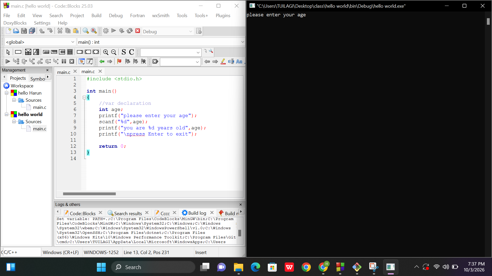
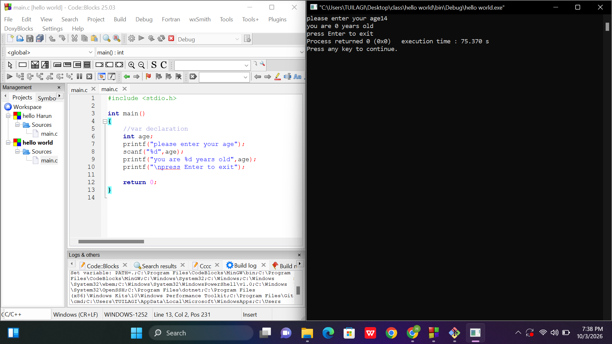

# Age Display Program (C Language)

A basic C console application built in Code::Blocks that prompts the user to enter their age and displays it back to the screen.

---

## Code Overview

```c
#include <stdio.h>

int main() {
    // Variable declaration
    int age;

    printf("Please enter your age: ");
    
    // Note: Always use the '&' (address-of) operator with scanf for primitive data types
    scanf("%d", &age);

    printf("You are %d years old\n", age);
    printf("\nPress Enter to exit");

    return 0;
}
```

---

## Program Execution & Output Screenshots

Below are screenshots demonstrating the compilation and execution of the program in Code::Blocks.

### 1. Program Prompting for User Input


### 2. Program Execution & Output Result


---

## How to Run

1. Open **Code::Blocks** (or any C IDE / GCC compiler).
2. Create a new C Project or open `main.c`.
3. Paste the code into `main.c`.
4. Click **Build and Run** (`F9`).
